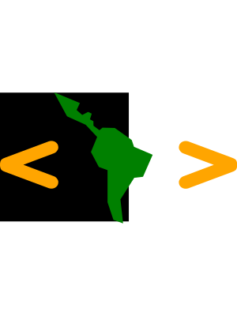

NOTAS SOBRE LA LECTURA "Integrando archivos SVG en nuestro HTML"
=================
## 0. REFERENCIAS: --*first things first*--
  
  * [Website de Peter Collin](https://www.petercollingridge.co.uk/tools/svg-optimiser/)
  * [Tutorial from scratch en MDN](https://developer.mozilla.org/en-US/docs/Web/SVG/Tutorial)
  * [Post en Medium sobre el 'head' de un SVG](https://medium.com/@peternowell/stuff-at-the-top-of-an-svg-f3ad198eb54e)
  * [Libro online: A pocket guide to writing SVG](https://svgpocketguide.com)

## 1. ALGUNAS ETIQUETAS

#### 1.1 BASE BOILERPLATE

```html
<!DOCTYPE svg....>
<svg version="" xmlns="" xmlns:xlink="" xml:space="">

  <defs>
    <style>
    </style>
  </defs>

  <!-- g permite agrupar elemetos gráficos en un bloque -->
  <!-- data-name sirve para identificar todo el bloque como 1 elemento -->
  <!-- transform permite rotar, escalar o recortar el contenido del bloque -->

  <g id="" data-name="" transform="">

    <path id="" data-name="" class="" d="aca va la carne" transform="">
  </g>

</svg>
```

<hr>

#### 1.1.1 LA ETIQUETA `<defs></defs>`

Dice la lectura que este elemento permite reutilizar contenido, para agregarlo a otros elementos pero luego muestra un ejemplo donde utiliza `<style>` so, WTF. OK, al menos parece que lo que sí hace es almacenar contenido no visible en el viewport del svg, *¿una especie de `<head>` quizá?*

<hr>

#### 1.1.2 LA ETIQUETA `<style></style>`

Esta simplemente funciona igual que en html, dándole estilos a los elementos apuntados en el selector. SVG define su propio *namespace* por lo que es importante conocer las propiedades que sirven para dar estilo a cada elemento dentro de SVG

<hr>

### 1.2 LA ETIQUETA `<path>`

- Esta etiqueta es el núcleo de los elemetos gráficos. Dentro de su atributo(atributo) `d=""` recibe 'comandos', -letras clave- y valores que representan todo tipo de trazos rectos y curvos.
- La lectura menciona que estos comandos listados a continuación distinguen entre mayúscula y minúscula de tal manera que los primeros dibujan trazos con posicionamiento absoluto y los segundos, relativos. MDN no menciona nada al respecto y sobre 'Z' incluso dice que no hay diferencia alguna.

Algunos comandos en la lectura: 

```
M: move to
L: line to
H: horizontal line to
V: vertical line to
S: smooth curve to
Q: quadratic Bezier curve to
T: smooth quadratic Bezier curve to
A: elliptical arc
Z: close path
```

Un ejemplo de la sintaxis:

```html
<path id="Path_1" data-name="Path 1" class="cls-1" d="M392.07,217.823v49.758L401.2,294.96l15,5.5-4.126-37.315,21.5-33.521,13.566-1.548,15.018-34.162-28.739-12.282-.257-.14L429.64,171l-26.317-18.712-19.033-.479-4.877,3.941-9.188-6.94-.126-7.064-5.377-2.811,2.815-8.9-5.688-2.655-9.1,4.69-8.689-7.612,5.064-10.891-38.77-16.152h-1.127l19.408,35.833a4.473,4.473,0,0,0,2.062,1.688l27.425,12.377,17.817,18.942L366.285,189.6l12.283,23.254Z" transform="translate(2832.419 3854.582)"/>
```

<hr>

#### 1.3 LA ETIQUETA `<rect>`

En vez del elemento `<path></path>` podemos usar el elemento <rect/> para crear rectángulos que pueden ser pintados a través de CSS: 

```html
<defs>
  <style>
    .rectangulo {
      fill: rgb(0, 0, 255);
    }
  </style>
</defs>

<rect width="400" height=""200" class="rectangulo"/>
```

<hr>

#### 1.4 LA ETIQUETA `<circle>`

Podemos crear formas circulares. Recibe coordenadas del centro y radio.

```html
<defs>
  <style>
    .circulo {
      fill: purple;
      stroke-width: 5px;
      stroke: red;
    }
  </style>
</defs>

<circle cx="100" cy="100" radio="70" class="circulo"/>
```

<hr>

#### 1.5 LA ETIQUETA `<polygon>`

Para crear formas con más de 3 lados. Los puntos que forman la figura se definen en el atributo `points="x1,y1 x2,y2 ..."` que recibe pares de valores x,y separados por coma entre ellos y cada par separado por espacio de otros pares. Ejemplo para una estrella: 

```html
<defs>
  <style>
    .estrella {
      fill: lime;
      stroke: blue;
      stroke-width: 5px;
    }
  </style>
</defs>

<polygon points="100,10 40,197 190,78 10,78 160,198" class="estrella"/>
```

<hr>

## 2. APUNTES  

- Un archivo SVG podría comenzar con una declaración XML y una declaración de DOCTYPE svg. Abajo un ejemplo de ambos:
  
```html
<?xml version='1.0' encoding='UTF-8' standalone='no' ?>
<!DOCTYPE svg PUBLIC "-//W3C//DTD SVG 1.1//EN" "http://www.w3.org/Graphics/SVG/1.1/DTD/svg11.dtd">
```

- Luego la etiqueta más importante: svg, esta declara el inicio de un *spacename* dentro del cual, todas las etiquetas tienen un significado determinado. Puede contener diferentes atributos, como `version`, `xmlns`, `xmlns:xlink`, y `xmlns:space`. Un ejemplo: 

```html
<svg version="1.1" xmlns="http://www.w3.org/2000/svg" xmlns:xlink="http://www.w3.org/1999/xlink" xml:space="preserve">
```

<hr>

#### 2.1 FORMAS DE INTEGRAR UN SVG (p.23-28)

Las **dos primeras formas** de integrar un svg en un archivo html (p.23) son a través del uso del archivo como imagen dentro del atributo `src` de `` o bien como imagen de fondo a través del valor `url(path)` dentro de la propiedad css `background-image`. En ambos casos no hay más control sobre esta imagen que el que habría sobre cualquier png o jpg.  

```html
<!-- Integrar una imagen SVG con etiqueta img -->


<!-- Integrar una imagen SVG con un imagen de fondo -->
<div class="logo"></div>
```

Para el 2do método, luego en CSS: 

```css
.logo {
height: 300px;
background-image: url(iso-desafio-latam.svg);
background-repeat: no-repeat;
}
```

La 3ra forma de integrar un archivo svg en nuestro código html es a través del uso de todo el código svg directamente dentro del código html. Esto permite agregarle `id`'s o `class`'es para darle estilo con CSS. 

```html
<svg xmlns="http://www.w3.org/2000/svg" width="300px" height="400px" viewBox="0 0 368 203">
  <defs>
    <!-- Este es el 'head' de un svg -->
  </defs>
  <rect width="200" height="200" fill="black"/>

  <g id="logo-desafio" data-name="Logo Desafio Latam" transform="translate(-3057.509 -3952)">
    <path id="latam-map" data-name="Latam Map" class="shape-latam" d="M392.07,217.823v49.758L401.2,294.96l15,5.5-4.126-37.315,21.5-33.521,13.566-1.548,15.018-34.162-28.739-12.282-.257-.14L429.64,171l-26.317-18.712-19.033-.479-4.877,3.941-9.188-6.94-.126-7.064-5.377-2.811,2.815-8.9-5.688-2.655-9.1,4.69-8.689-7.612,5.064-10.891-38.77-16.152h-1.127l19.408,35.833a4.473,4.473,0,0,0,2.062,1.688l27.425,12.377,17.817,18.942L366.285,189.6l12.283,23.254Z" transform="translate(2832.419 3854.582)"/>
    <path id="left-chevron" data-name="Left chevron" class="shape-chevron" d="M316.955,219.375l-46.928-17.628,46.928-17.628c4.875-1.5,6.753-6.47,6.753-6.47,1.593-3.561-.6-7.781-.6-7.781-5.875-8.627-15.344-3.845-15.344-3.845l-65.416,24.41c-5.687,1.875-6.814,3.876-6.814,3.876-2.188,3.127-1.794,7.438-1.794,7.438s-.394,4.313,1.794,7.442c0,0,1.129,2,6.814,3.873l65.416,24.41s9.469,4.782,15.344-3.843c0,0,2.191-4.221.6-7.784C323.707,225.846,321.83,220.876,316.955,219.375Z" transform="translate(2823.794 3862.266)"/>
    <path id="right-chevron" data-name="Right chevron" class="shape-chevron" d="M571.7,194.435s-1.126-2-6.813-3.876l-65.416-24.41s-9.468-4.782-15.344,3.845c0,0-2.189,4.218-.594,7.782,0,0,1.874,4.969,6.75,6.47l46.93,17.627L490.282,219.5c-4.876,1.5-6.75,6.47-6.75,6.47-1.6,3.563.594,7.781.594,7.781,5.875,8.627,15.344,3.845,15.344,3.845l65.416-24.41c5.688-1.875,6.813-3.876,6.813-3.876,2.187-3.126,1.8-7.439,1.8-7.439S573.885,197.561,571.7,194.435Z" transform="translate(2852.258 3862.28)"/>
  </g>
</svg>
```
 y luego en CSS podemos hacer por ejemplo: 

 ```css
.shape-latam {
  fill: green;
}

.shape-chevron {
  fill: orange;
}
 ```

Por último, la cuarta forma (p.28) de integrar un archivo svg será a través del elemento html `<object data="" type=""></object>` donde el atributo `data`  albergará la *path* del archivo y el atributo `type` su MIME/type que en el caso de los archivos svg será `image/svg+xml` Una buena práctica será agregar el mismo archivo pero como `` a modo de fallback del elemento object.

```html
<!-- Integrar un SVG usando etiqueta object -->
<object data="iso-desafio-latam.svg" type="image/svg+xml">

</object>
```

<hr>

Finalmente, las últimas páginas van sobre la optimización de archivos SVG. La lectura menciona que muchas veces los generadores automáticos de íconos svg dejan mucho marcado basura que es bueno eliminar. Menciona el uso de una herramienta creada por Peter Collin alojada en una url que en el momento de esta lectura está con error 500. Ver referencias para mirar una entrada de blog del creador.
## 3. OBSERVACIONES PERSONALES

- Al parecer todos estos atributos son necesarios en la declaración del estándar 1.1 de SvG pero no así en el estándar 2.0 **REVISAR**
- **REVISAR:** diferencia entre width/height y viewBox, y tamaño 'natural' de un archivo svg. (p.10)
- En el inspector solo se aprecian los atributos height y width del elemento svg. El atributo viewBox no aparece por ningún lado. 
- Al parecer, los elementos dentro del viewport svg siguen un stacking context similar al de html. Por lo menos hay un ejemplo donde un elemento situado más "arriba" en el código fuente queda tapado por otro que aparece después. (p.20)